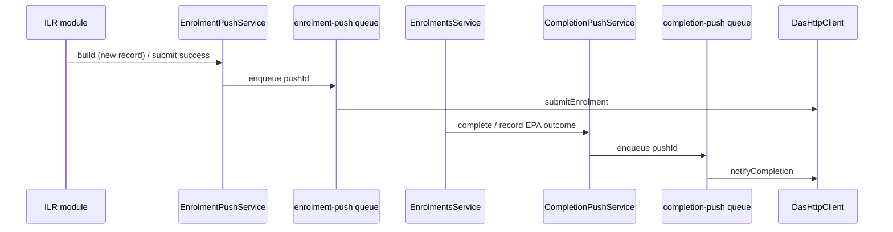

# DAS outbound push (enrolment + completion)

Gradlly → DAS outbound notifications per PRD `07-integrations.md` §8.1.

## Flow

## Triggers

| Push | Trigger | When |
|------|---------|------|
| Enrolment submission | `ilr_created` | New ILR learner record built (`POST /ilr/learner-records/build`) |
| Enrolment submission | `ilr_submitted` | ESFA submit worker succeeds |
| Completion notification | `enrolment_completed` | `POST /enrolments/:id/complete` |
| Completion notification | `epa_outcome_recorded` | `POST /enrolments/:id/epa-outcome` |

Idempotency: unique `(ilrLearnerRecordId, trigger)` and `(enrolmentId, trigger)` prevent duplicate rows; delivered pushes are not re-queued.

## API

- `GET /api/v1/enrolment-pushes/:id` — poll enrolment push status
- `GET /api/v1/enrolment-pushes/failed` — list failed enrolment pushes
- `POST /api/v1/enrolment-pushes/:id/retry` — manual retry
- `GET /api/v1/completion-pushes/:id` — poll completion push status
- `GET /api/v1/completion-pushes/failed` — list failed completion pushes
- `POST /api/v1/completion-pushes/:id/retry` — manual retry
- `POST /api/v1/enrolments/:id/epa-outcome` — record EPA outcome (completed enrolments only)

Status lifecycle: `queued → processing → delivered | failed`

## Configuration

| Env | Default | Purpose |
|-----|---------|---------|
| `DAS_BASE_URL` | — | DAS API base (required for live push) |
| `DAS_TOKEN_URL` | — | OAuth token endpoint |
| `DAS_CLIENT_ID` / `DAS_CLIENT_SECRET` / `DAS_SCOPE` | — | OAuth credentials |
| `DAS_ENROLMENT_SUBMIT_PATH` | `/api/apprenticeships/enrolments` | Enrolment submission POST path |
| `DAS_COMPLETION_NOTIFY_PATH` | `/api/apprenticeships/completions` | Completion notification POST path |

Queues: `enrolment-push`, `enrolment-push-dlq`, `completion-push`, `completion-push-dlq` (inspectable via queue ops API when enabled).

## EPA outcomes

Minimal `epa_outcomes` entity supports PRD-002 completion payload (`epaOutcome` field). Full gateway journey (PRD-008) builds on this in a later phase.
