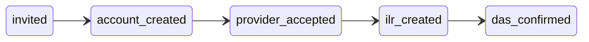

# Cross-portal enrolment pipeline

Employer → provider → apprentice flow per PRD `01-platform.md` §2.4 and PRD-003 / PRD-018.

## Pipeline states

Monotonic forward progression (no rollback):

| State | Meaning | Typical trigger |
|-------|---------|-----------------|
| `invited` | Apprentice portal invitation sent | `POST /enrolments/:id/activate` |
| `account_created` | Apprentice user linked (`apprenticeUserId`) | Invitation accept or existing user on activate |
| `provider_accepted` | Provider accepted the enrolment | `POST /enrolments/:id/accept-provider` |
| `ilr_created` | First ILR learner record built | `POST /ilr/learner-records/build` (new record) |
| `das_confirmed` | DAS enrolment push delivered | `enrolment-push` worker success |

Draft enrolments have `pipelineState: null` until activation.

## Activate side effects

`POST /api/v1/enrolments/:id/activate`:

1. Sets status `active` and `activatedAt`
2. When `ENROLMENT_AUTO_INVITE_APPRENTICE=true` (default):
   - If a platform user exists for the apprentice email → link `apprenticeUserId`, advance to `account_created`
   - Else → create invitation (`PortalType.APPRENTICE`, `enrolmentId` set), advance to `invited`
3. Notify provider org admins (`GENERIC` notification, `action: pending_provider_accept`)

Apprentice invitations target the **enrolment-owning organisation** (RLS requires the activator to be a member).

## Provider acceptance

`POST /api/v1/enrolments/:id/accept-provider`

- Caller org must match `providerOrganisationId`, or owning `organisationId` when no provider link is set
- Enrolment must be `active`
- Pipeline must be at least `account_created`

## Configuration

| Env | Default | Purpose |
|-----|---------|---------|
| `ENROLMENT_AUTO_INVITE_APPRENTICE` | `true` | Send apprentice invite / link on activate |

## API fields

`EnrolmentResponseDto` includes `pipelineState` and per-step timestamps (`pipelineInvitedAt`, … `pipelineDasConfirmedAt`).

## Related modules

- `src/enrolments/enrolment-pipeline.service.ts` — monotonic `advanceIfAhead`
- `src/enrolments/enrolment-provisioning.service.ts` — activate + invitation accept hooks
- `src/invitations/invitations.service.ts` — `createForEnrolment`, `enrolmentId` on accept
- DAS push: see [das-push.md](./das-push.md)
