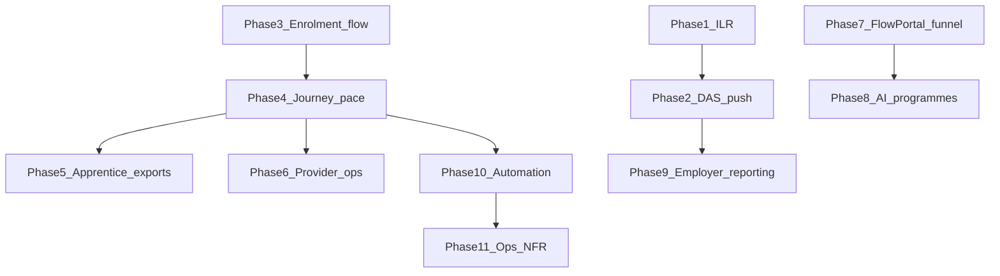

# PRD API implementation plan (Phase 1 MVP)

Master execution plan for closing API gaps between the PRD and this codebase. Use this doc for **order of work**, **phase boundaries**, and **progress tracking**.

| Doc | Role |
|-----|------|
| [prd-api-checklist.md](./prd-api-checklist.md) | What is missing (gap inventory + checkboxes) |
| **This doc** | In what order to ship, how to ship each slice, where we are |
| [PROJECT-TASKS.csv](../PROJECT-TASKS.csv) | Task IDs, story points, CSV status |
| [docs/prd/](./prd/) | Product requirements source |

**MVP scope:** [09-release-phases.md](./prd/09-release-phases.md) §10.1

---

## Progress tracker

Update this table when starting or completing a phase. Status: `not_started` · `in_progress` · `done` · `skipped`

| Phase | Name | Tasks | Priority | ~SP | Status | Branch / PR | Completed |
|-------|------|-------|----------|-----|--------|-------------|-----------|
| 1 | ILR / ESFA production | PRD-004, PRD-005 | P0 | 18 | done | feat/prd-phase-1-ilr-hardening | 2026-06-09 |
| 2 | DAS outbound sync | PRD-001, PRD-002 | P0/P1 | 13 | done | feat/prd-phase-2-das-push | 2026-06-09 |
| 3 | Cross-portal enrolment flow | PRD-003, PRD-018 | P1 | 10 | not_started | — | — |
| 4 | Apprentice journey + pace | PRD-008, PRD-006 | P0 | 16 | not_started | — | — |
| 5 | Apprentice exports | PRD-007, PRD-020 | P0/P1 | 13 | not_started | — | — |
| 6 | Provider operations | PRD-009, PRD-010, PRD-021, PRD-011 | P1 | 23 | not_started | — | — |
| 7 | FlowPortal funnel | PRD-014, PRD-015, PRD-017 | P0/P1 | 23 | not_started | — | — |
| 8 | FlowPortal AI programmes | PRD-016 | P0 | 13 | not_started | — | — |
| 9 | Employer reporting + DAS funding | PRD-012, PRD-013 | P1 | 16 | not_started | — | — |
| 10 | Automation and chasers | PRD-019, PRD-023, PRD-024 | P2/P1 | 11 | not_started | — | — |
| 11 | Ops and NFR | PRD-022, GDP-001, PERF-001 | P2 | 8 | not_started | — | — |

**Totals:** 24 PRD tasks + 3 ops items · ~164 story points · 11 PR-sized phases

---

## How we work (phase ritual)

Each phase is one shippable slice — typically one branch and one PR.

**Required deliverables (all three, every phase):**

| # | Deliverable | Done when |
|---|-------------|-----------|
| 1 | **Unit specs** | New/changed services, processors, serializers have `.spec.ts` coverage |
| 2 | **E2e route(s)** | Happy path + key guards in `test/*.e2e-spec.ts` |
| 3 | **Detailed Swagger** | All touched endpoints/DTOs documented in Scalar (`/docs`): `@ApiOperation` descriptions, request/response schemas, error responses, `@ApiProperty` examples |

1. **Branch** — `feat/prd-phase-N-short-name` (e.g. `feat/prd-phase-1-ilr-hardening`)
2. **Mark** — set phase status to `in_progress` in the progress tracker above
3. **Implement** — migration + API + **Swagger** + unit specs + e2e route(s)
4. **Verify** — `yarn lint`, `yarn test`, targeted `yarn test:e2e`; spot-check `/docs`
5. **Update tracking**
   - Checkboxes in [prd-api-checklist.md](./prd-api-checklist.md)
   - `Status` column in [PROJECT-TASKS.csv](../PROJECT-TASKS.csv)
   - Progress tracker row: `done`, branch/PR link, completion date
6. **Pause** — review, commit, push
7. **Continue** — say **Phase N+1** (or **next phase**) to start the next slice

---

## Dependency overview

Phases 1, 3, and 7 can start independently once their prerequisites are met. Phase 8 is the largest greenfield slice and does not block compliance work in phases 1–2.

---

## Phase 1 — ILR / ESFA production

| | |
|--|--|
| **Tasks** | PRD-004, PRD-005 |
| **Related CSV** | ILR-003 |
| **Priority / size** | P0 · XL (~18 SP) |
| **Branch** | `feat/prd-phase-1-ilr-hardening` |

**Goal:** Replace noop ILR submit with production-ready XML + async queue processing.

**Deliverables**

- XML serializer (replace JSON stub in `src/ilr/ilr-payload-serializer.service.ts`)
- Harden `IlrEsfaHttpClient`; receipt persistence on submissions
- `ilr-submit` BullMQ queue + processor + DLQ; idempotent submit/amend
- Extend `src/ilr/ilr-submission.service.ts` to enqueue instead of sync submit
- Unit specs + extend `test/ilr.e2e-spec.ts` with mock ESFA (`ILR_ESFA_PROVIDER=http`)
- **Detailed Swagger** on submit/amend/poll endpoints and `IlrSubmissionResponseDto` (async lifecycle, errors, examples)

**Key modules:** `src/ilr/`, `src/bullmq/` (mirror `src/withdrawal-push/` pattern)

**Exit criteria**

- Submit and amend run via BullMQ worker
- XML payload generated before ESFA client call
- E2e passes with mocked ESFA; failed jobs inspectable via queue ops API
- Swagger at `/docs` documents async flow, status lifecycle, and error responses on all changed ILR endpoints

**Unblocks:** Phase 2 (DAS enrolment push on ILR create/submit)

---

## Phase 2 — DAS outbound sync

| | |
|--|--|
| **Tasks** | PRD-001, PRD-002 |
| **Related CSV** | DAS-005 |
| **Priority / size** | P0/P1 · L (~13 SP) |
| **Branch** | `feat/prd-phase-2-das-push` |

**Goal:** Push enrolment and completion events to DAS within PRD SLA, mirroring withdrawal push.

**Deliverables**

- Enrolment submission push: queue on ILR learner record create/submit → DAS API (≤5 min)
- Completion notification push: queue on enrolment completion + EPA outcome
- Status entity, retry, DLQ (mirror `src/withdrawal-push/`)
- Unit + e2e; extend DAS mock fixtures

**Key modules:** new push module(s) alongside `src/withdrawal-push/`, `src/das/`, hook from `src/ilr/`

**Exit criteria**

- Both push types enqueue, process, persist status, surface failures
- E2e covers success and simulated DAS failure paths

**Unblocks:** Phase 9 (funding sync builds on DAS client maturity)

---

## Phase 3 — Cross-portal enrolment flow

| | |
|--|--|
| **Tasks** | PRD-003, PRD-018 |
| **Related CSV** | DOM-003, INV-002 |
| **Priority / size** | P1 · M (~10 SP) |
| **Branch** | `feat/prd-phase-3-enrolment-flow` |

**Goal:** Support platform §2.4 learner enrolment flow — pipeline states and auto-provisioned apprentice accounts.

**Deliverables**

- Pipeline sub-states: `invited → account_created → provider_accepted → ilr_created → das_confirmed`
- Expose on enrolment DTO + transition hooks
- On enrolment activate: invite or provision P3 user + link to apprentice record
- Wire to invitations + notifications

**Key modules:** `src/enrolments/`, `src/invitations/`, `src/apprentices/`

**Exit criteria**

- Enrolment API returns pipeline state
- Activating enrolment creates/links apprentice portal user
- Unit + e2e for state transitions and provisioning

**Unblocks:** Employer tracking (PRD-010), platform cross-portal flows

---

## Phase 4 — Apprentice journey + smart pace

| | |
|--|--|
| **Tasks** | PRD-008, PRD-006 |
| **Related CSV** | OTJ-003 |
| **Priority / size** | P0 · L (~16 SP) |
| **Branch** | `feat/prd-phase-4-journey-pace` |

**Goal:** Deliver programme timeline, gateway checklist, EPA date, and PRD-accurate OTJ pace alerts.

**Deliverables**

- Migration: `epaDate` on enrolment (or milestone table)
- Gateway criteria per standard (seed from standard metadata)
- `GET /enrolments/:id/journey` — timeline milestones + checklist + days-to-EPA
- Notify provider when checklist reaches 100% (F3.2.2)
- Replace 30-day minutes heuristic in `src/otj/otj-pace.service.ts` with 15%/30% behind EPA-target pace
- Persist alert level; in-app notifications (+ optional email)

**Key modules:** `src/enrolments/`, `src/otj/`, `src/notifications/`, `src/programmes/`

**Exit criteria**

- Journey endpoint returns milestones, checklist, days-to-EPA
- Pace cron creates notifications at PRD thresholds (not 30-day heuristic)
- E2e covers journey read and pace alert creation

**Unblocks:** Phase 5, Phase 6 (intervention queue), Phase 10 (digest content)

---

## Phase 5 — Apprentice exports

| | |
|--|--|
| **Tasks** | PRD-007, PRD-020 |
| **Related CSV** | PFL-002, PDF-002 |
| **Priority / size** | P0/P1 · M (~13 SP) |
| **Branch** | `feat/prd-phase-5-apprentice-exports` |

**Goal:** Apprentice EPA evidence pack and unified document library.

**Deliverables**

- `POST /portfolio/epa-pack-jobs` → async PDF/ZIP (accepted evidence, KSB summary, reviews, OTJ summary, commitment PDF)
- Poll + download URL (reuse PDF/ZIP job patterns from `src/ofsted/`)
- `GET /learners/me/documents` — signed commitments, review PDFs, evidence metadata + download URLs

**Key modules:** `src/portfolio/`, `src/pdf/`, `src/commitments/`, `src/reviews/`

**Exit criteria**

- Apprentice can request EPA pack and poll to completion
- Document library returns all signed docs with presigned URLs
- E2e covers job lifecycle and document list

**Unblocks:** F3.3.4, F3.4.3 MVP acceptance

---

## Phase 6 — Provider operations

| | |
|--|--|
| **Tasks** | PRD-009, PRD-010, PRD-021, PRD-011 |
| **Related CSV** | EIF-001, RPT-002 |
| **Priority / size** | P1 · L (~23 SP) |
| **Branch** | `feat/prd-phase-6-provider-ops` |

**Goal:** Provider cohort management, at-risk queue, learner profile aggregate, and real EIF inputs.

**Deliverables**

- `GET /learners/intervention-queue` (severity sort); `POST .../:enrolmentId/interventions`
- Wire overdue reviews + OTJ off_track (from Phase 4)
- `GET /learners/cohort` — unified columns + filters + CSV export
- `GET /learners/:enrolmentId/profile` — single-call aggregate
- Remove `safeguarding_stub` / `programme_docs_stub` in `src/eif/eif-score-calculator.service.ts`; update `eif-criteria.v1.json`

**Key modules:** new `src/learners/` or extend reporting, `src/eif/`, `src/reviews/`, `src/otj/`

**Exit criteria**

- Provider sees sorted intervention queue and can log actions
- Cohort + profile endpoints return PRD columns
- EIF scores use real metrics (no fixed stub percents)

**Unblocks:** F2.2.1–2.2.4, F2.1.1 MVP acceptance

---

## Phase 7 — FlowPortal funnel

| | |
|--|--|
| **Tasks** | PRD-014, PRD-015, PRD-017 |
| **Related CSV** | LEX-003 |
| **Priority / size** | P0/P1 · L (~23 SP) |
| **Branch** | `feat/prd-phase-7-flowportal-funnel` |

**Goal:** Anonymous eligibility, ESFA registration wizard, and SME dashboard aggregate.

**Deliverables**

- `POST /levy-exchange/eligibility/check` (no auth) — size, sector, region, DAS flag → eligible / not eligible / advisor + funding band
- Wizard session entity; step endpoints (Companies House, PAYE, DAS status, bank details, consent); resume token; confirmation email hook
- `GET /reporting/sme-overview` — active count, pending OTJ approvals, reviews due, commitment pipeline, apprentice list with OTJ %

**Key modules:** `src/levy-exchange/`, new wizard module, `src/reporting/`

**Exit criteria**

- Anonymous eligibility returns PRD-shaped response
- Wizard persists, resumes, and completes all steps
- SME overview returns aggregate counts and apprentice list

**Unblocks:** Phase 8 (AI programmes enrolment on FlowPortal orgs)

**Note:** F4.2.4 / F4.3.4 (concierge) are ops/process — no API in this phase.

---

## Phase 8 — FlowPortal AI programmes (Module C)

| | |
|--|--|
| **Tasks** | PRD-016 |
| **Related CSV** | DOM-001 |
| **Priority / size** | P0 · XL (~13 SP, greenfield) |
| **Branch** | `feat/prd-phase-8-ai-programmes` |

**Goal:** Minimum API surface for AI apprenticeship programmes on FlowPortal (F4.4.1–4.4.3).

**Deliverables**

- Entity design aligned with [08-data-model.md](./prd/08-data-model.md) **before** migrations
- Programme catalogue scoped to FlowPortal orgs
- Learner enrolment on AI track
- Progress and completion records
- Full module: migration, services, controllers, unit specs, e2e

**Key modules:** new `src/ai-programmes/` (or extend `src/programmes/` with delivery-type discriminator)

**Exit criteria**

- FlowPortal org can list AI programmes, enrol learners, record progress/completion
- RLS and org scoping enforced; e2e covers happy path

**Unblocks:** F4.4.1–4.4.3 MVP acceptance

---

## Phase 9 — Employer reporting + DAS funding

| | |
|--|--|
| **Tasks** | PRD-012, PRD-013 |
| **Related CSV** | DAS-002, RPT-001 |
| **Priority / size** | P1 · L (~16 SP) |
| **Branch** | `feat/prd-phase-9-employer-reporting` |

**Goal:** Levy utilisation history and daily DAS funding payment sync for employer dashboards.

**Deliverables**

- Persist DAS transaction/contribution history on sync
- `GET /reporting/levy-utilisation` — 12-month series + segments (used / expiring / available) + cost-per-apprentice table
- Daily cron + `das_funding_payments` table
- Expose funding summary on SME/employer reporting APIs

**Key modules:** `src/das/`, `src/reporting/`, `src/scheduler/`

**Exit criteria**

- Employer sees monthly contribution/spend series
- Funding confirmations sync daily via cron
- E2e or integration test for sync + read API

**Unblocks:** F1.1.3 MVP acceptance

---

## Phase 10 — Automation and chasers

| | |
|--|--|
| **Tasks** | PRD-019, PRD-023, PRD-024 |
| **Related CSV** | NOTIF-005, REV-002, COM-002 |
| **Priority / size** | P2/P1 · M (~11 SP) |
| **Branch** | `feat/prd-phase-10-automation` |

**Goal:** Commitment chasers, OTJ digest emails, and apprentice 48h review reminders.

**Deliverables**

- Cron: unsigned commitment parties after 7 days → email + in-app per role
- Wire `src/bullmq/processors/digest.processor.ts` to compile per-org/per-apprentice summary; enqueue from `src/scheduler/digest-cron.service.ts`
- Add `48h` to `ReviewReminderKind`; cron dispatch to apprentice

**Key modules:** `src/commitments/`, `src/bullmq/`, `src/scheduler/`, `src/reviews/`

**Exit criteria**

- All three crons registered in worker
- Unit tests cover scan logic; e2e or processor tests verify notification/email enqueue

**Unblocks:** F1.3.x, F3.1.4, F3.2.4 chaser acceptance

---

## Phase 11 — Ops and NFR

| | |
|--|--|
| **Tasks** | PRD-022, GDP-001, PERF-001 |
| **Related CSV** | CRON-001, GDP-001, PERF-001 |
| **Priority / size** | P2 · S–M (~8 SP) |
| **Branch** | `feat/prd-phase-11-ops-nfr` |

**Goal:** Production cron configuration, retention operator visibility, and load-test sign-off.

**Deliverables**

- Document required production env in [secrets-checklist.md](./secrets-checklist.md)
- Consider `true` defaults for production crons when `NODE_ENV=production` (`CRON_DAS_SYNC_ENABLED`, `CRON_OTJ_PACE_ENABLED`, `CRON_REVIEW_REMINDERS_ENABLED`, `CRON_RETENTION_ENABLED`)
- Optional `GET /platform/retention/runs` (ops API key) or document worker-only retention operation
- Run staging checklist in [performance.md](./performance.md); record k6 results in repo or CI artifact

**Key modules:** `src/config/env.schema.ts`, `src/data-retention/`, `load/k6/`, `docs/`

**Exit criteria**

- Secrets checklist complete for all production crons
- Retention operation documented or exposed via ops endpoint
- Load-test results recorded

**Deferred unless explicitly requested:** native push channel (FCM/APNs) — device token entity + registration API stub

---

## Out of scope

- Frontend UI acceptance criteria (API-only repo)
- F4.2.4 onboarding concierge, F4.3.4 SME concierge (ops/process)
- Native push notifications (defer to Phase 2 mobile or explicit Phase 11 add-on)
- Phase 2 PRD features: automated levy matching ML, SAR auto-generation, native apps, enterprise API, etc.
- Live DAS/ESFA production credentials (config + verify in staging; not code in these phases)

---

## Quick reference — PRD task → phase

| Task | Phase | Task | Phase |
|------|-------|------|-------|
| PRD-004 | 1 | PRD-012 | 9 |
| PRD-005 | 1 | PRD-013 | 9 |
| PRD-001 | 2 | PRD-019 | 10 |
| PRD-002 | 2 | PRD-023 | 10 |
| PRD-003 | 3 | PRD-024 | 10 |
| PRD-018 | 3 | PRD-022 | 11 |
| PRD-008 | 4 | GDP-001 | 11 |
| PRD-006 | 4 | PERF-001 | 11 |
| PRD-007 | 5 | PRD-016 | 8 |
| PRD-020 | 5 | PRD-014 | 7 |
| PRD-009 | 6 | PRD-015 | 7 |
| PRD-010 | 6 | PRD-017 | 7 |
| PRD-021 | 6 | | |
| PRD-011 | 6 | | |

---

## Document control

| Version | Date | Change |
|---------|------|--------|
| 1.0 | 2026-06-09 | Initial plan — 11 phases synced with prd-api-checklist.md and PROJECT-TASKS.csv |
| 1.1 | 2026-06-09 | Phase ritual: require unit + e2e + detailed Swagger on every phase |
